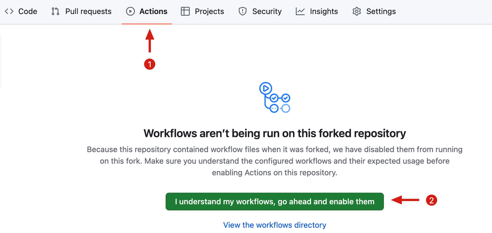
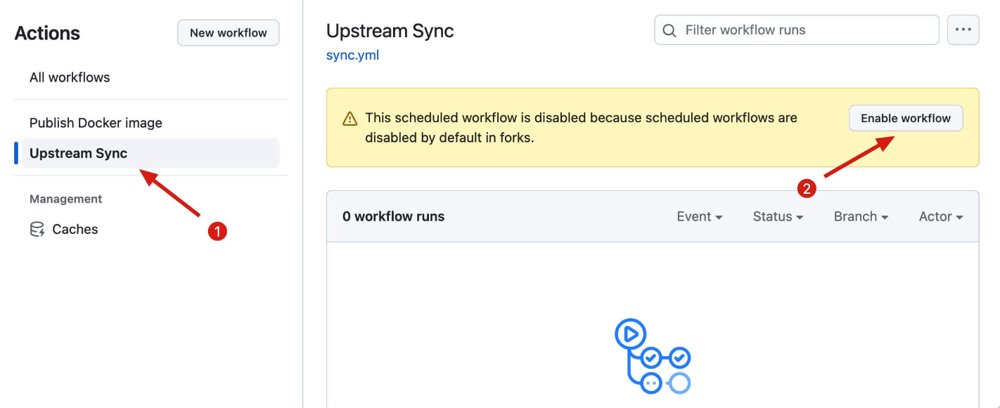

# Sync Fork

If you wish to automatically update your forked code, you can follow these steps:

如果你希望保持 fork 代码的同步更新，可以按以下步骤来操作：

## 1. First

Click Actions tab and enable the workflows

点击 Actions 标签页然后启用 workflows

## 2. Second

Click `Upstream Sync` and enable this workflow

点击 `Upstream Sync` 并且启用该 workflow

